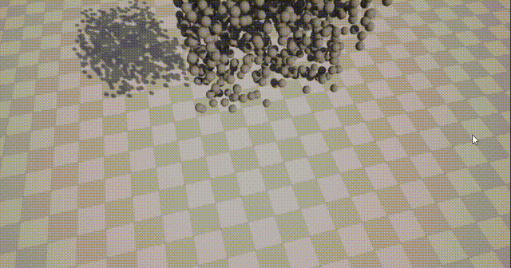

# Taichi/CUDA/ComputeShader in UE5.0.3

在这一项目中我们分别使用TaichiAOT，CUDA，ComputeShader模块在UE5.0.3中实现了1024个小球的含碰撞自由落体, 128*128网格布料的运动模拟。

自由落体使用牛顿力学模拟，布料网格使用弹簧质点系统牛顿力学模拟，相关模拟算法均采用最简单直接方式实现，项目主要目的在于在UE5.0.3中运行。


### 文件说明

* 基本的运动效果演示可以通过Taichi运行查看 *:

自由落体运动基本演示（需要python和taichi环境，建议使用Taichi1.1.3或Taichi1.2.2）

```shell
cd \RelatedAlgorithmSourceCode\FreeFall_taichi\pythonCode
python Taichi_FreeFall_Render.py
```

布料模拟基本演示（需要python和taichi环境，建议使用Taichi1.1.3或Taichi1.2.2）

```shell
cd \RelatedAlgorithmSourceCode\ClothSimulation_taichi\pythonCode 
python Taichi_ClothSimulation_Render.py
```


在\RelatedAlgorithmSourceCode对应的文件夹中可以查看CUDA，HLSL，TaichiAOTapp.cpp相关的代码。

* 相关UEdemo放在名称对应文件夹: *

在对应的文件夹下有相关的说明文档，演示效果和项目文件夹。

比如“UE5CS_ClothSimulation”是使用Computer Shader在UE中实现布料模拟的demo。

比如在"UE5taichi_FreeFall"中可以看到Taichi_AOT_FreeFall效果，与python中的演示效果基本一致：




### 额外注意事项

Compute Shader模块实现在plugins当中。

CUDA的项目中需要在build.cs文件中配置对应主机的Nvidia cuda路径。

Taichi编译好的C_API文件打包在对应项目中TaichiCAPI文件，本项目的C_API使用taichi官方branch bump/1.2.2版本编译获得。

由于Taichi运行需要taichi_c_api.dll动态库，所以保留了相关UE项目binary文件。

