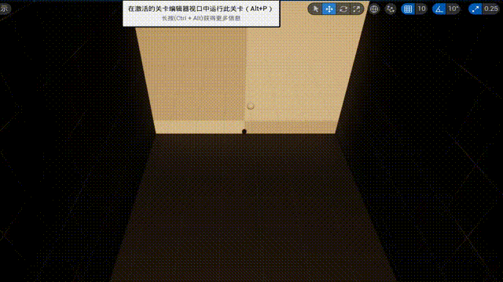

# CUDA FreeFall  

### Demo效果

编译运行项目后，在编辑器界面内容浏览器选择MyAssets/level/CudaFree.CudaFree，对应关卡play即可查看自由落体效果，效果如下所示。



### 实现思路

CUDA实现相应的算法，打包为.lib静态库。

注: 在CUDAProjectCLSI\Source\CUDAProjectCLSI\CUDAProjectCLSI.Build.cs文件中，替换CUDA路径

```shell
string cuda_path = "C:/Program Files/NVIDIA GPU Computing Toolkit/CUDA/v11.7"; #替换为对应主机CUDA安装路径
```

### 参考

略

